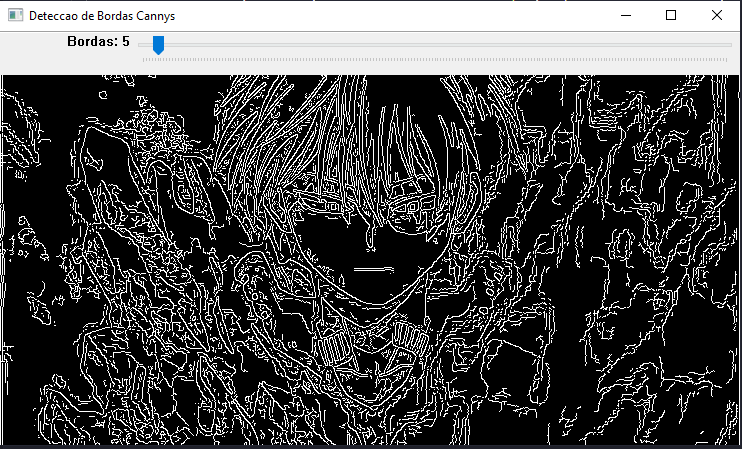

# PI-Explorer

Neste repositório, tem algumas atividades práticas que foram realizadas na faculdade relativas a Processamento de Imagem e desenvolvida ao longo do semestre. Para isto, seguiremos as instruções [deste tutorial](https://agostinhobritojr.github.io/tutorial/pdi/), disponibilizado em livre acesso pelo professor Agostinho Brito.

A cada semana, abordamos um dos conceitos do material, durante o período da aula, e em seguida você deve realizar a respectiva tarefa. O prazo de entrega da tarefa era de cerca de 10 dias após a discussão em aula sobre o conteúdo. Isso permitiu que eu pudese alinhar eventuais duvidas com o professor na aula seguinte e conseguir finalizar dentro do prazo de entrega.

Cada entrega realizada foi entregue em uma pasta específica para o mesmo e além do código, desenvolvi um report (read.me). Este report apresenta exemplos de entrada e saída (resultados) do algoritmo. Além disso, todas as atividades podem ser iniciadas a partir de códigos de exemplo disponibilizados com a respectiva lição. Dessa forma, o relatório também deve destacou as partes do código que desenvolvi, explicando em detalhes o funcionamento e a lógica que utilizei.

Ao todo foram 8 entregas, organizadas da seguinte maneira:

- [x] 1. [Manipulando Imagens](#manipulando-imagens)
- [x] 2. [Preenchimentos](#preenchimentos)
- [x] 3. [Histogramas](#histogramas)
- [x] 4. [Filtragem Espacial I](#filtragem-espacial-i)
- [x] 5. [Filtragem Espacial II](#filtragem-espacial-ii)
- [x] 6. [Filtragem Frequência](#filtragem-frequência)
- [x] 7. [Detecção de Bordas](#detecção-de-bordas)
- [x] 8. [K-means](#kmeans)

Os exemplos disponíveis encontram-se em C++, mas você pode desenvolver as atividades em outra linguagem de sua preferência, desde que utilize o OpenCV. 

# Sobre as atividades
Para a realização dessa atividade optei por fazer na linguagem Python, pois pensei que a curva de aprendizagem era menor em relação ao C++. Sendo assim, todas as as resoluções foram adapatadas de acordo com linguagem escolhida podendo ter algumas diferenças do que foi apresentado no exemplo da explicação.

Manipulando Imagens
=================

<details>
  <summary>:scissors: Explicação e exemplos da atividade</summary><br />  
  
  Nessa atividade, há três exercícios: <b>pixels</b>, <b>regions</b> e <b>changeregions</b>
  
  1. No [Exemplo Pixels](ManipulandoImagens/pixels.py) é a atividade exemplo para aprender como resolver a atividade, alguns comandos foram adaptados de acordo com a linguagem Python.

  ---
  
  2. No [Exerecício de Regiões](ManipulandoImagens/regions.py) nesse exercício utilizei uma imagem pessoal da minha gata Haru, mas a imagem era muito grande, então criei a função `reduzir_imagem` apenas para reduzir o tamanho da imagem apresentada para poder ser visualizado. Tornando assim a imagem de tamanho **300X400**.

  ```bash
  def reduzir_imagem(imagem):
    porcetagem_escala = 10
    largura = int(imagem.shape[1] * porcetagem_escala / 100)
    altura = int(imagem.shape[0] * porcetagem_escala / 100)
    dimensao_imagem = (largura, altura)
    return cv.resize(imagem, dimensao_imagem, interpolation = cv.INTER_AREA)
  ```
  
  Para deixar a imagem negativa foi usado:
  ```bash
  255 - imagem_reduzida[p1_c:p1_a,p2_c:p2_a]
  ```

  E colocado na matiz do pyhton:
  ```bash
  imagem_reduzida[p1_c:p1_a,p2_c:p2_a]
  ```

  ### Exemplos de utilização

  Para testar o programa é só editar os paramêtros. Então P1 é composto por p1i e p1j, assim como P2 é composto por p2i e p2j, sendo implementados assim: regions(p1i,p1j, p2i,p2j)

  - Exemplo 1:
  ```bash
    regions(40,301,150,250)
  ```
  Saída:
  
  

  - Exemplo 2:
  ```bash
    regions(60,350,50,200)
  ```  
  Saída:
  
  

  - Exemplo 3:
  ```bash
    regions(105,200,80,130)
  ```  
  Saída:
  
  

  Basta tirar o comentário e comentar o próximo utilizando #
  ```bash
  regions(40,301,150,250) //Esse roda
  # regions(60,350,50,200) //Esse não
  ```
  ---
  
  3 - No [Exerecício de Troca de Regiões](ManipulandoImagens/changeregions.py)
  
   Primeiro verifica utiliza o `.shape` que permite pegar o tamnho da imagem inserida:
  
   ```bash
    (altura, largura) = imagem.shape[:2] # Como essa função pega 3 paramêtros e só utilizo os dois priemiros coloco [:2]
   ```
   <br/>
  
   Divido o valor da largura e altura pela metade para pegar um fatia da imagem:
  
   ```bash
    (p1m, p2m) = (largura // 2, altura // 2)
   ```
  
   Uso o `.copy()` para fazer uma cópia da imagem original
  
   ```bash
    imagem_1 = imagem.copy()
    imagem_2 = imagem.copy()
   ```
   ### Etapas de monstagem da imagem

   Posiciono dentro da imagem real a imagem cortada deixando na posição que deve ficar:

   ```bash
    imagem_1[:p1m,:p2m] = imagem[p1m:,p1m:]
   ```

   A `imagem_1` a saída mostra o primeiro quadrado da imagem cortada.

   ```bash
    cv.imshow("Trocar de Posicao a Imagem", imagem_1)
   ```
   Saída:
  
   

   Depois faz uma cópia dessa imagem e posiciona o próximo quadrado cortado ao lado, formando a parte de cima da imagem.

   ```bash
    imagem_top = imagem_1.copy()
    imagem_top[:p2m,p1m:] = imagem[p2m:,:p1m]
   ``` 
  A `imagem_top` formou a parte de cima com os dois recortes na posição certa.
  Com esse comando abaixo pode-se ver a imagem de saida:

  ```bash
    cv.imshow("Trocar de Posicao a Imagem", imagem_top)
  ```
  Saída:
  
  

  Para a próxima etapa fiz uma cópia da imagem pronta da parte de cima e uni com a imagem recortada do lado esquerdo montando uma imagem com 3 quadrados nas suas respectivas posições.

  ```bash
    imagem_tres_quadros = imagem_top.copy()
    imagem_tres_quadros[p2m:,:p1m] = imagem[:p2m,p1m:]
  ```
  
  Se colocar para imprimir o `imagem_tres_quadros` monta a imagem dos 3 quadrados em suas devidas posições.
 
  ```bash
    cv.imshow("Trocar de Posicao a Imagem", imagem_tres_quadros)
  ```
  Saída:
  
  

  Para finalizar e apresentar a imagem correta copiei a imagem com os 3 quadrados e adicionei o último quadrado na imagem.

  ### Exemplo de utilização

  - Exemplo:
  Para apresentar a imagem correta toda recortada e seus quadrados nas respoectrivas posições utiliza-se esse comando.
 
  ```bash
    cv.imshow("Trocar de Posicao a Imagem", imagem_complete)
  ```
  Saída:
  
  
</details>

Preenchimentos
=================

<details>
  <summary>:purple_square: Explicação e exemplos da atividade</summary><br />  
  
  Nessa atividade, há três exercícios: <b>labeling</b>, <b>labeling_ex1</b> e <b>labeling_ex2</b>
  
  1. No [Exemplo de Preenchimento](Preenchimentos/labeling.py) é a atividade exemplo para aprender como resolver a atividade, alguns comandos foram adaptados de acordo com a linguagem Python.

   Para converter as cores da imagem utilizei o `cvtColor` e para definir os tons de cinza adicionei a propriedade de cor `cv.COLOR_BGR2GRAY`:

   ```bash
    imagem = cv.cvtColor(imagem, cv.COLOR_BGR2GRAY)
   ```

   Usei o `.shape` para pegar o tamanho da imagem em largura e altura:

   ```bash
     (width, height) = imagem.shape[:2]
   ```
  
   Criei um contador de número de objetos e iniciei zerado:
  
   ```bash
     nobjetos = 0
   ```
    
   Para usar o `floodFill` necessita criar uma máscara da imagem, que é definida nessa linha:
  
   ```bash
     mascara = np.zeros((height + 2, width + 2), np.uint8)
   ```
  
   Para poder identificar quantos pixels são claros (pixel de cor 255) criei uma recursividade que utiliza o tamanho da imagem para identificar a quantidade de pixels e toda vez que encontrar um pixel da cor 255 adiciona no contador que encontrou um objeto novo e no `floodFill` vai rotulando os objetos da imagem:

  ```bash
    for i in range(0, height):
      for j in range(0, width):
        if imagem[i,j] == 255:
          #achou um objeto
          nobjetos = nobjetos + 1

          # preenche o objeto com o contador
          cv.floodFill(imagem, mascara, (j,i), nobjetos)
   ```

   Utilizei o `equalizeHist` na imagem para melhorar a identificação da rotulação:
  
   ```bash
     realce = cv.equalizeHist(imagem)
   ```
   Se executar o comando abaixo pode-se ver a imagem normal em tons de cinza e a imagem com realce para identificar a rotulação:
  
   ```bash
     cv.imshow('Imagem', imagem)
     cv.imshow('Realce', realce)
   ```

   Saída:
    
   
  
   Ao finalizar grava a imagem nova rotulada:
  
   ```bash
     cv.imwrite("labeling.png", imagem)
   ```  
  
   Saída:

   
  
  ---
  
   2. No [Atividade de Preenchimento 1](Preenchimentos/labeling_ex1.py) é para limitar se uma imagem tem mais de 255 objetos, pois torna o processo de rotulação mais lento.

   Para resolver esse problema utilizei o contador de objetos e limitei em um if se o número for menor ou igual a 255 aceita fazer a rotulação se não adiciona `True` na flag `erro`:
   
   ```bash
     for i in range(0, height):
      for j in range(0, width):
        if imagem[i,j] == 255:
          #achou um objeto
          nobjetos = nobjetos + 1

          if nobjetos <= 255:
            # preenche o objeto com o contador
            cv.floodFill(imagem, mascara, (j,i), nobjetos)
          else:  
            erro = True
   ```
   
   Então se a imagem tiver mais que 255 objetos aparece um erro no console, se não aparece a nova imagem rotulada:

   ```bash
     if erro is not True:
       print('width: ', width)
       print('height: ', height)

       # Numero de objetos está errado. Conta pixels 255 e não as bolhas em si
       print('Total de bolhas: ', nobjetos)

       realce = cv.equalizeHist(imagem)
       cv.imshow('Imagem', imagem)
       cv.imshow('Realce', realce)
                            
       #Salva imagem                     
       cv.imwrite("doble_labeling.png", imagem)
     else:
       print('Imagem possui mais de 255 objetos, dificulta a rotulacao. Por favor selecione outra imagem com menos objetos.')
   ```
   Se o número de objetos é MAIOR que 255.

   Saída:

   
                            
   Se o número de objetos é MENOR que 255, salva imagem como `doble_labeling.png`.                            
   Saída:

          
                            
   ---
   
   3. No [Atividade de Preenchimento 2](Preenchimentos/labeling_ex2.py) é aprimorar o algoritmo de contagem apresentado para:
      3.1. Identificar regiões com ou sem buracos internos que existam na cena;
      3.2. Assumir que objetos com mais de um buraco podem existir;
      3.3. Inclua suporte no algoritmo para não contar bolhas que tocam as bordas da imagem;
      3.4. Não se pode presumir, a priori, que elas tenham buracos ou não.

   Para o item 3.1 peguei o inverso da cor:
   
   ```bash
     #inverso da cor
     imagem = 255 - imagem
   ```
   Saída:
                            
      
   
   Defini que tudo que fosse fundo mudasse para preto, deixando apenas os buracos brancos de dentro das bolhas:
   
   ```bash
     for i in range(0, height):
        for j in range(0, width):
          if any(imagem[i,j] == [255,255,255]):
            #achou um objeto
            nobjetos = nobjetos + 1

            # preenche o objeto com o contador
            cv.floodFill(imagem, mascara, (0,0), nobjetos)
   ```
   Saída:
    
     
   
</details>

Histogramas
=================
  
<details>
  <summary>:bar_chart: Explicação e exemplos da atividade</summary><br/>
  
  Nessa atividade, há três exercícios: <b>histogram</b>, <b>equalize</b> e <b>motiondetector</b><br/>
  
  1. No [Histograma](Histogramas/histogram.py) é uma atividade exemplo para capturar uma imagem colorida pela camera e convertendo identificando o RGB e fazer um histograma de cada cor.
  
  
  O `nbins` é o tamanho do vetor do histograma no caso defini como 128 para ter uma visualização melhor do histograma. O `histRange` colocasse o valor máximo e mínimo de faixa de cor que vai usar, no caso vai de 0 (zero) até 255.
  
  ```bash
    nbins = 128
    histRange = [0, 255]
  ```
  
  Abre uma conexão com a câmera da posição 0 e verifica se está vindo imagem, caso não venha aparece um retorno no console e sai do programa.

  ```bash
    cap = cv2.VideoCapture(0)

    if not cap.isOpened():
      print("camera indisponiveis")
      return
  ```
  Definir o tamanho da imagem capturada pela câmera com as propridades do OpenCV: `cv2.CAP_PROP_FRAME_WIDTH` e `cv2.CAP_PROP_FRAME_HEIGHT`, no caso largura é 640 e a altura 480
  
  ```bash
    cap.set(cv2.CAP_PROP_FRAME_WIDTH, 640)
    cap.set(cv2.CAP_PROP_FRAME_HEIGHT, 480)
    width = cap.get(cv2.CAP_PROP_FRAME_WIDTH)
    height = cap.get(cv2.CAP_PROP_FRAME_HEIGHT)
  ```
  Abaixo como se defini o tamanho dos histogramas para cada cnal de cor, como se usa o `np.zero` defini-se a tipagem dos dados para pegar 8bits.
  
  ```bash
    histImgR = np.zeros((histh, histw, 3), dtype="uint8")
    histImgG = np.zeros((histh, histw, 3), dtype="uint8")
    histImgB = np.zeros((histh, histw, 3), dtype="uint8")
  ```
  
  Enquanto tiver captando imagem a cada frame lido `ret, frame = cap.read()` é separado em planos para serem analisados e gerado um histograma de cor daquela imagem captada, para isso se utiliza o `.split` para melhor separação das cores detectadas na captura. E passado os valores calculados de cada cor RGB para o `.calcHist` do OpenCV para gerar um histograma ainda não normalizado.
  
  ```bash
    while(True):
    ret, frame = cap.read()

    planes = cv2.split(frame)

    histR = cv2.calcHist(planes[0], [1], None, [nbins], histRange)
    histG = cv2.calcHist(planes[1], [1], None, [nbins], histRange)
    histB = cv2.calcHist(planes[2], [1], None, [nbins], histRange)
  ```
  
  A cada histograma é normalizado uma faixa de valores de zero até a quantidade máxima de linhas das imagens analisadas para pegar os pontos do menor ao maior daquela faixa de cor. Assim poder desenhar no histograma esses dados encontrados.
  
  ```bash
    cv2.normalize(histR, histR, 0, histImgR.shape[1], cv2.NORM_MINMAX, -1)
    cv2.normalize(histG, histG, 0, histImgG.shape[1], cv2.NORM_MINMAX, -1)
    cv2.normalize(histB, histB, 0, histImgB.shape[1], cv2.NORM_MINMAX, -1)
  ```
  
  Depois de normalizado para desenhar o histograma usamos uma função do OpenCV `.line` que desenha as linhas do histograma, faz uma cópia dessa informação dentro da imagem com o `.copy`, como não consegui colcoar dentro da imagem usei o `.rectangle` para desenhar um retangulo com a informação do histograma em três janelas diferentes.
  
  ```bash
    histImgR = np.zeros((histh, histw, 3), dtype="uint8")
    histImgG = np.zeros((histh, histw, 3), dtype="uint8")
    histImgB = np.zeros((histh, histw, 3), dtype="uint8")

    for i in range(nbins):
      cv2.line(histImgR, (i, histh),
               (i, histh - round(histR[i][0])), [0, 0, 255], 1, 8, 0)
      cv2.line(histImgG, (i, histh),
               (i,  histh - round(histG[i][0])), [0, 255, 0], 1, 8, 0)
      cv2.line(histImgB, (i, histh),
               (i,  histh - round(histB[i][0])), [255, 0, 0], 1, 8, 0)

    imgR = histImgR.copy()
    imgG = histImgG.copy()
    imgB = histImgB.copy()

    cv2.rectangle(imgR, (0, 0), (nbins, histh),  [0, 0, 255])
    cv2.rectangle(imgG, (0, histh), (nbins, histh),  [0, 255, 0])
    cv2.rectangle(imgB, (0, 2*histh), (nbins, histh),  [255, 0, 0])

    cv2.imshow('Hist. Verm.', imgR)
    cv2.imshow('Hist. Verde', imgG)
    cv2.imshow('Hist. Azul', imgB)
    cv2.imshow('Imagem', frame)
  ```
  Abaixo o retorno de como ficou a imagem capturada pela câmera e seus histogramas.
  
  Saída:
    
   
  
    
   

  ---
  
  2. No [Equalizador](Histogramas/equalize.py) se converte para tons de cinza a imagem e demonstra a imagem obtida pela camera e a imagem equalizada com os seus devidos equalizadores.
  
  Para essa atividade a parte inicial foi utilizado a anterior. Então, defnição do tamanho de vetor, range utilizado, captura de imgem, tamanho da imagem capturada, looping enquanto o programa roda permanece o mesmo.

  O que muda como é analisada as imagens capturadas. O frame analisado transformei para escala de cinza `cv2.COLOR_BGR2GRAY`.

  ```bash
    _, frame = cap.read()
    frame = cv2.cvtColor(frame, cv2.COLOR_BGR2GRAY)
  ```
  
   Com imagem capturada gerei uma equalização dela atrovés do `.equalizeHist` do próprio OpenCV, depois gerei histograma `imgFrame` para imagem normal `frame` e um histograma para imagem equalizada `img` e presentei a imagem tmbém equalizada `equalizedFrame`.
  
  ```bash
    equalizedFrame = cv2.equalizeHist(frame)

    equalizedHist = cv2.calcHist(equalizedFrame, [0], None, [nbins], histRange)
    frameHist = cv2.calcHist(frame, [0], None, [nbins], histRange)

    histImg = np.zeros((histh, histw), dtype="uint8")
    histFrame = np.zeros((histh, histw), dtype="uint8")

    cv2.normalize(equalizedHist, equalizedHist, 0,
                  histImg.shape[1], cv2.NORM_MINMAX, -1)
    cv2.normalize(frameHist, frameHist, 0,
                  histFrame.shape[1], cv2.NORM_MINMAX, -1)

    for i in range(nbins):
      cv2.line(histImg, (i, histh),
               (i, histh - round(equalizedHist[i][0])), [255], 1, 8, 0)
      cv2.line(histFrame, (i, histh),
               (i, histh - round(frameHist[i][0])), [255], 1, 8, 0)

    img = histImg.copy()
    imgFrame = histFrame.copy()

    cv2.rectangle(img, (0, 0), (nbins, histh), [0])
    cv2.rectangle(imgFrame, (0, 0), (nbins, histh), [0])

    cv2.imshow('equalizedHist', img)
    cv2.imshow('equalized', equalizedFrame)

    cv2.imshow('frameHist', imgFrame)
    cv2.imshow('frame', frame)
  ```
  Ao final apresentei a esquerda a imagem normal capturada e a direita imagem após a equalização com os seus devidos histogramas no retangulo a direita acima de cada uma delas.
  
  Saída:
    
   
  
  ---
  
  3. No [Detector de Movimento](Histogramas/motiondetector.py) continua calculando o histograma da imagem, no caso deixei a imagem em tons de cinza, e comparando com o último histograma calculado  Quando o calculo tem diferença entre um limiar pré-estabelecido, ative um alarme, no caso é uma frase no console `ALERTA: MOVIMENTO DETECTADO!`.
  
  As declarções iniciais são iguais as outras atividades e a imagem capturada converto para tons de cinza:
 
  ```bash
    nbins = 128
    histRange = [0, 255]

    cap = cv2.VideoCapture(0)

    if not cap.isOpened():
      print("Could not open video device")
      return

    cap.set(cv2.CAP_PROP_FRAME_WIDTH, 640)
    cap.set(cv2.CAP_PROP_FRAME_HEIGHT, 480)
    width = cap.get(cv2.CAP_PROP_FRAME_WIDTH)
    height = cap.get(cv2.CAP_PROP_FRAME_HEIGHT)

    print(f"largura = {width}")
    print(f"altura = {height}")

    histw = nbins
    histh = nbins // 2

    old_frame = cv2.cvtColor(cap.read()[1], cv2.COLOR_BGR2GRAY)
  ```
  O limite definido foi de 1000. E a partir da primeira interação entra no looping. Calcula o histograma do frame atual(`current_frameHist`) e do antigo (`old_frameHist`).
Para comparar os histogramas foi usado uma função própria do OpenCV o `.compareHist` usando o calculo de Kullback-Leibler `cv2.HISTCMP_KL_DIV` que fica registrado na variável `result`.
  
  ```bash
  max_difference = 1000
  old_result = None

  first_iteration = True

  while(True):
    current_frame = cv2.cvtColor(cap.read()[1], cv2.COLOR_BGR2GRAY)

    current_frameHist = cv2.calcHist(current_frame, [0], None, [nbins], histRange)
    old_frameHist = cv2.calcHist(old_frame, [0], None, [nbins], histRange)

    result = cv2.compareHist(current_frameHist, old_frameHist, cv2.HISTCMP_KL_DIV)
  ```
  
  Enquanto o `old_result` não existir mantem o mesmo valor que tiver em `result`. Para calcular a diferença (`difference`) usa a função do python `abs` para nunca ter valores negativos e voltar tipo número. Se a diferença for maior que o limite definido aparecer um alerta no console de movimento detectado e apresenta o vídeo da captura da câmera.
 
  ```bash
    if not old_result:
      old_result = result

    difference = abs(result - old_result)

    if difference > max_difference:
      print(f"movement detected: {result} - difference: {difference} - max_difference: {max_difference}")
      print(f"ALERTA: MOVIMENTO DETECTADO!")

    cv2.imshow('frame', current_frame)

    if cv2.waitKey(1) & 0xFF == ord('q'):
      break

    old_frame = current_frame
    old_result = result
  ```
  
  Quando o objeto se mexe, no console apresenta que deu diferença e aparece o alerta de movimento.
  
  Saída:
    
   
  
  
   
  
   [Video MP4 do programa rodando](Resources/histogram_examples/Exemplo_movimento.mp4)
  
</details>

Filtragem Espacial I
=================
  
<details>
<summary> :white_square_button: Explicação e exemplos da atividade</summary>
  
  1. No [Filtragem Espacial I](FiltragemEspacial1/filtragemespacial.py) adiciona filtros sobre a imagem capturada, sendo eles: *media, gauss, horizontl, vertical, laplacian*.
  Esses filtros já vem definidos em variáveis de mesmo.
  
  ```bash
    def main():
      media = [0.1111, 0.1111, 0.1111, 0.1111, 0.1111, 0.1111, 0.1111, 0.1111, 0.1111]
      gauss = [0.0625, 0.125,  0.0625, 0.125, 0.25, 0.125,  0.0625, 0.125,  0.0625]
      horizontal = [-1, 0, 1, -2, 0, 2, -1, 0, 1]
      vertical = [-1, -2, -1, 0, 0, 0, 1, 2, 1]
      laplacian = [0, -1, 0, -1, 4, -1, 0, -1, 0]
      boost = [0, -1, 0, -1, 5.2, -1, 0, -1, 0]
      frameFiltered = np.zeros((3, 3))
      result = np.zeros((3, 3))
  ```
  
  Após definição desses filtros, abre a conexão com a câmera, testa se funcionou, defini o tamanho da captura. Uma máscara é criada com os parâmetros definidos para o array de `media` com formato 3 por 3. Definimos o `absolute` como `True` para ser usado em um dos filtros. Se a captura está funcionando entra no looping.
  
   ```bash
    cap = cv2.VideoCapture(0)

    if not cap.isOpened():
      print("Could not open video device")
      return

    cap.set(cv2.CAP_PROP_FRAME_WIDTH, 640)
    cap.set(cv2.CAP_PROP_FRAME_HEIGHT, 480)

    mask = np.reshape(media, (3, 3))

    absolute = True

    while(True):
 ```

Dentro do while pega o frame da captura e transforma para tons de cinza. Mostra uma tela da imagem capturada original, usa a mesma captura que está `framegray` uso o `.flip` para inverter a imagem, transformamos para 32 bits em float com `.float32` do Python na variável `frame32f`. Na variável `frameFiltered` utilizei um método do OpenCV chamado `.filter2D` que faz com que a imagem que está sendo usada passe para kernel e crie um filtro linear sobre ela, interpolando valores de pixels discrepantes de acordo com o modo de borda especificado.
  
 ```bash
    while(True):
      ret, frame = cap.read()

      framegray = cv2.cvtColor(frame, cv2.COLOR_BGR2GRAY)

      cv2.imshow("original", framegray)

      framegray = cv2.flip(framegray, 1)

      frame32f = np.float32(framegray)
      frameFiltered = cv2.filter2D(frame32f, cv2.CV_32F, mask, anchor=(1, 1), delta=0)
  ```
  Se o `absolute` for verdadeiro converto o valor do `frameFiltered` com o `.abs` do np para converter os valores em positivos. O `result` recebe os valores de `frameFiltered` limitados a 8bits com o `.unit8` que vai até 255 máximo. E apresento o retorno de result.
  
  ```bash
      if absolute:
        frameFiltered = np.abs(frameFiltered)

      result = np.uint8(frameFiltered)

      cv2.imshow("filtroespacial", result)

  ```
  Na tela de nome `filtroespacial` conforme a tecla que aperta apresenta um filtro sobre a imagem capturada: * a = absolute, m = mask, g = gauss, h = horizontal, v = vertical, l = laplacian e b = boost *.
  
  ```bash
      key = cv2.waitKey(10)

      if key != -1:
        key = chr(key)

      if key == '\x1b':
        break

      if key == 'a':
        absolute = not absolute
      elif key == 'm':
        mask = np.reshape(media, (3, 3))
        print(mask)
      elif key == 'g':
        mask = np.reshape(gauss, (3, 3))
        print(mask)
      elif key == 'h':
        mask = np.reshape(horizontal, (3, 3))
        print(mask)
      elif key == 'v':
        mask = np.reshape(vertical, (3, 3))
        print(mask)
      elif key == 'l':
        mask = np.reshape(laplacian, (3, 3))
        print(mask)
      elif key == 'b':
        mask = np.reshape(boost, (3, 3))
        print(mask)

      if cv2.waitKey(1) & 0xFF == ord('q'):
        break 

    cv2.waitKey()
  ```
  
  Retorno da imagem **gauss**.
  
  Saída:
    
   
  
  Retorno do Filtro **absolute**.
  
  Saída:
  
   
  
  Retorno do Filtro **boost**.
  Saída:
  
   
  
  Retorno do Filtro horizontal.
  
  Saída:
  
   
  
  Retorno do Filtro **laplacian**.
  
  Saída:
  
   
  
  Retorno do Filtro **mask**.
  
  Saída:
  
   
  
  Retorno do Filtro **vertical**.
  
  Saída:
  
   
 
  
  ---
  
  2. No [Laplaciano do gaussiano](FiltragemEspacial1/laplgauss.py) tem que se adicionar mais um efeito misturando dois dos calculos em um mesmo filtro, sendo os calculos:  *laplaciano do gaussian de imagem capturada*.
  
  Foi realizado uma concatenação dos dois calculos, fazendo o laplaciano sobre gauss, usando o `.concatenate` do próprio np. O usuário que clicar: *t = laplaciano do gaussian*. 
  
  ```bash
    elif key == 't':
      mask = np.float32(np.concatenate((np.reshape(gauss, (3, 3)), np.reshape(laplacian, (3, 3)))))
      print(mask)
  ```
  
  Foi usado outro objeto par visualizar melhor o novo filtro combinado.

  Saída:
    
  
  
  Se compararmos os filtros separados:
  
   Retorno da imagem **gauss**.
  
  Saída:
    
  

  Retorno do Filtro **laplacian**.
  
  Saída:
  
  
  

O novo filtro ele pega bordas da imagem e o lapaciano trata pontos dessas bordas para melhor visualização. Pondendo visualizar os constornos dos objetos dentro da imagem.

   Saída:
    
   
  
</details>
  
Filtragem Espacial II
=================
  
<details>
<summary>:black_square_button: Explicação e exemplos da atividade</summary>

Nessa atividade, há três exercícios: <b>addweighted</b>, <b>tiltshift</b> e <b>tiltshiftvideo</b><br/>
  
  1. No [Add Weighted](FiltragemEspacial2/addweighted.py) é uma atividade exemplo de Addweighted que é um combinação linear de duas imagens f0(x,y) e f1(x,y) (plano do foco da imagem). O programa abaixo fará o calculo da combinação linear fornecendo duas saídas. Para o controle de Alpha que é o blend usa-se o `addWeighted` do próprio OpenCV para fazer o cálculo linear que dá o efeito de sobreposição com desfoque e para o Scanline no controle de line define-se o tamanho limiteda imagem sobreposta até que posição dá para aumentar e diminuir.
  
```bash
  image1 = cv2.imread("Resources/blend1.jpg")
  image2 = cv2.imread("Resources/blend2.jpg")
  imageTop = image2.copy()

  if type(image1).__module__ != "numpy":
      print("Arquivo não encontrado")

  if type(image2).__module__ != "numpy":
      print("Arquivo não encontrado")

  alfa = 0.0
  alfa_slider = 0
  alfa_slider_max = 100
  top_slider = 0
  top_slider_max = 100
  TrackbarName = ''


  def on_trackbar_blend(param):
      global alfa_slider
      global alfa

      alfa_slider = param
      alfa = alfa_slider/alfa_slider_max
      blended = cv2.addWeighted(image1, 1-alfa, imageTop, alfa, 0.0)
      cv2.imshow("addweighted", blended)


  def on_trackbar_line(top_slider):
      global imageTop

      imageTop = image1.copy()
      limit = top_slider*255//100
      if limit > 0:
          imageTop[:limit] = image2[:limit]
          cv2.imshow("addweighted", imageTop)

      on_trackbar_blend(alfa_slider)


  def main():
      cv2.namedWindow("addweighted", 1)

      TrackbarName = "Alpha x {0}".format(alfa_slider_max)
      cv2.createTrackbar(TrackbarName, "addweighted", alfa_slider,
                         alfa_slider_max, lambda x: on_trackbar_blend(x))
      on_trackbar_blend(alfa_slider)

      TrackbarName = "Scanline x {0}".format(top_slider_max)
      cv2.createTrackbar(TrackbarName, "addweighted", top_slider,
                         top_slider_max, lambda x: on_trackbar_line(x))
      on_trackbar_line(top_slider)

      cv2.waitKey()
```
    O resultado da combinação vai gerar uma janela com duas barras de controle `on_trackbar_blend` e `on_trackbar_line`, sendo uma para regular o valor alpha que altera o distânciamento do foco da imagem da sua projeção e o outro controle é a região a ser copiada da entrada da composição com o objetivo de não alterar a região central para que o efeito til-shift funcione posteriormente. Esse resultado pode ser visualizado pelas imagens abaixo.
  
   Saída:

  <table align="center">
    <tr>
      <td align="center"></td>
      <td align="center"></td>      
      <td align="center"></td>
      <td align="center"></td>
    </tr>
  </table>
  
  Pode-se observar a cópia da imagem mantendo a região central e uma imagem sobreposta com uma função filtrada com as bordas borradas por um filtro da média.
  
  2. No [Tiltshift](FiltragemEspacial2/tiltshift.py) é uma atividade exemplo da simulação da técnica fotográfica tilt-shift, que usa deslocamento e rotações para o efeito de desfoque seletivo da região. No caso podendo controlar a região de desfoque pelo `Gauss` definir a área do a ser defocada pelos controles superior `top` e inferior `bottom` como também podendo suavizar o limite da área borrada com o controle de `Decay`.
    
    A diferença dessa resolução para a anterior que para o desfoque utiliza-se a `GaussianBlur` do openCV, que utiliza a fórmula de Gauss pegando o tamanho da imagem e as direções de desvio definidas para aumentar ou diminuir o ruido da image. Já a suavização de bordas é usado o valor de `decay_bar_slider` como divisor nos tamnhos passados par o calculo de Alpha.
  
    ```bash

      def tiltshift():
        global image
        global top_limit
        global bottom_limit

        top_limit = top_bar_slider*255//100
        image[top_limit:] = original_image[top_limit:]

        if top_limit > 0:
            image[:top_limit] = cv2.GaussianBlur(
                original_image[:top_limit], (gauss_bar_slider, gauss_bar_slider), 0)

        bottom_limit = 255 - (bottom_bar_slider*255//100) + 1

        if bottom_limit == 256:
            bottom_limit = bottom_limit - 1

        if bottom_limit > 0:
            image[bottom_limit:] = cv2.GaussianBlur(
                original_image[bottom_limit:], (gauss_bar_slider, gauss_bar_slider), 0)

        x = np.arange(image.shape[0], dtype=np.float32)

        alpha_x = (np.tanh((x - top_limit) / decay_bar_slider) -
                   np.tanh((x - bottom_limit) / decay_bar_slider)) / 2

        mask = np.repeat(alpha_x, image.shape[1]).reshape(image.shape[:2])

        blur = cv2.GaussianBlur(
            image, (gauss_bar_slider * 2 + 1, gauss_bar_slider * 2 + 1), 0)

        mask = cv2.cvtColor(mask, cv2.COLOR_GRAY2BGR)

        image[:top_limit] = original_image[:top_limit]
        image[bottom_limit:] = original_image[bottom_limit:]

        result = cv2.convertScaleAbs(image * mask + blur * (1 - mask))

        cv2.imshow("main", result)


    def on_top_bar_slide(value):
        global top_bar_slider

        top_bar_slider = value
        tiltshift()


    def on_bottom_bar_slide(value):
        global bottom_bar_slider

        bottom_bar_slider = value
        tiltshift()


    def on_gauss_bar_slider(value):
        global gauss_bar_slider

        if value % 2 == 0:
            value = value + 1

        if value == 0:
            value = 1

        gauss_bar_slider = value
        tiltshift()


    def on_decay_bar_slider(value):
        global decay_bar_slider

        if value % 2 == 0:
            value = value + 1

        decay_bar_slider = value
        tiltshift()


    def main():
        cv2.namedWindow("main", 1)

        cv2.createTrackbar("Top x {0}".format(top_bar_slider_max), "main", top_bar_slider,
                           top_bar_slider_max, on_top_bar_slide)
        cv2.createTrackbar("Bottom x {0}".format(bottom_bar_slider_max), "main", bottom_bar_slider,
                           bottom_bar_slider_max, on_bottom_bar_slide)
        cv2.createTrackbar("Gauss x {0}".format(gauss_bar_slider_max), "main", gauss_bar_slider,
                           gauss_bar_slider_max, on_gauss_bar_slider)
        cv2.createTrackbar("Decay x {0}".format(decay_bar_slider_max), "main", decay_bar_slider,
                           decay_bar_slider_max, on_decay_bar_slider)

        cv2.waitKey()


    if __name__ == '__main__':
        main()
    ```
  
  Após relizado altura que está em foco e regular a intensidade do decaimento da região borrada, apresenta o seguinte resultado:
   Saída: 
    
   <table align="center">
    <tr>
      <td align="center"></td>
      <td align="center"></td>      
      <td align="center"></td>
      <td align="center"></td>
      <td align="center"></td>
    </tr>
  </table>
  
  3. No [Tiltshift Video](FiltragemEspacial2/tiltshiftvideo.py) é uma atividade exemplo do uso da filtragem de modo bidirecional a partir do dominio da frequência na transformada discreta de Fourier (DFT) aplicado em um vídeo. 

    Para a resolução dessa atividade utiliza quase o mesmo código que o na atividade anterior, mudndo apenas entrada para receber o vídeo e aplicado o efeito no frame capturado do vídeo:
  
  ```bash
     speed = 4
      skip_frame = 0

      while True:
          ret, frame = cap.read()

          if skip_frame == 0:
              result = tiltshift(frame)
              cv2.imshow("main", result)

              skip_frame = (skip_frame + 1) % speed
          else:
              skip_frame = (skip_frame + 1) % speed
  ```

   É gerada uma imagem borrada devido a filtragem das altas frequências numa sequência de vídeo, podendo ser controlada da mesma forma qua a atividade anterior.
  
   Saída:
    
   
  
   [Video MP4 do programa rodando](Resources/filtragel_espacial_ii_examples/tiltshiftvideo.mp4)
</details>

Filtragem Frequência
=================
  
<details>
<summary>:radio_button: Explicação e exemplos da atividade</summary>
  
Nessa atividade tem o exercício: <b>dft</b><br/>.
  
  1. No [DFT](FiltragemFrequencia/dft2.py) é ums atividade que utilizando uma imagem em tons de cinza, precisa-se manipular a imagem mal iluminada e ajustar os filtros denominados homórficos para corrigir a iluminação.
  
  O `getOptimalDFTSize` é uma função do OpenCV, que através do tamanho passado identifica qual é o melhor valor de base par ser calculado o DFT, sendo multiplos de 2, 3 e 5. Guardando em variáveis `dft_M` e `dft_N` o tamanho ideal de linhs e colunas.

  ```bash
  def main():
      global dft_M
      global dft_N

      cv2.namedWindow("original", 1)
      cv2.namedWindow("homomorphic", 1)

      dft_M = cv2.getOptimalDFTSize(image.shape[0])
      dft_N = cv2.getOptimalDFTSize(image.shape[1])

      cv2.createTrackbar("Gamma Low", "homomorphic", gamma_low_slider,
                         gamma_low_slider_max, on_gamma_low_slider)
      cv2.createTrackbar("Gamma High", "homomorphic", gamma_high_slider,
                         gamma_high_slider_max, on_gamma_high_slider)
      cv2.createTrackbar("d_zero", "homomorphic", d0_slider,
                         d0_slider_max, on_d0_slider)
      cv2.createTrackbar("c", "homomorphic", c_slider,
                         c_slider_max, on_c_slider)

      homomorphic()

      cv2.waitKey()
  ```
  O `copyMakeBorder` é uma função do OpenCV que defini as bordas da imagem como zeros par ser usado no cálculo do DFT. Contruindo uma matriz de zeros em `zeros`. Calculando a função de tranferência em `complex_image` e gerando uma matriz temporária `tmp` calcula o filtro passa-baixas ideal e á merge na matriz de filtros com a matriz de complexa. Faz o cálculo de DFT com a própria função do OpenCV (`dft`) realiza a troca de quadrantes com `move_dft`. Aplica o filtro de frequenci do OpenCV `mulSpectrums`. Clcula o defete inverso `idft` dos quadrantes trocados. Gerando assim a nova imagem normalizada.

  ```bash
    def homomorphic():
      gl = gamma_low_slider // 100
      gh = gamma_high_slider // 100
      d0 = 25 * d0_slider // 100
      c = c_slider // 100

      cv2.imshow("original", image_gray)

      padded = cv2.copyMakeBorder(image_gray, 0,  dft_M - image.shape[0], 0, dft_N - image.shape[1], cv2.BORDER_CONSTANT)

      zeros = np.float32(np.zeros(padded.shape))

      real_input = np.float32(padded.copy())

      planos = [real_input, zeros]

      complex_image = cv2.merge(planos)

      tmp = np.float32(np.zeros((dft_M, dft_N)))

      complex_image = cv2.dft(complex_image)

      complex_image = move_dft(complex_image)

      for x in range(tmp.shape[0]):
          for y in range(tmp.shape[1]):
              d2 = (x-dft_M//2)*(x-dft_M//2)+(y-dft_N//2)*(y-dft_N//2)

              tmp[x, y] = (gamma_high_slider-gamma_low_slider) * \
                  (1 - math.exp(-(c*d2/(d0*d0)))) + gamma_low_slider

      comps = [tmp, tmp]
      my_filter = cv2.merge(comps)
      complex_image = np.float32(complex_image)
      complex_image = cv2.mulSpectrums(complex_image, my_filter, 0)

      complex_image = move_dft(complex_image)

      complex_image = cv2.idft(complex_image)

      planos = cv2.split(complex_image)

      cv2.normalize(planos[0], planos[0], 0, 1, cv2.NORM_MINMAX)
      cv2.imshow("filtrada", planos[0])

  def move_dft(image):
      cx = image.shape[0] // 2
      cy = image.shape[1] // 2

      A = image[:cx, :cy]
      B = image[:cx, cy:]
      C = image[cx:, :cy]
      D = image[cx:, cy:]

      tmp = A.copy()
      A = D.copy()
      D = tmp.copy()

      tmp = C.copy()
      C = B.copy()
      B = tmp.copy()

      image[:cx, :cy] = A
      image[:cx, cy:] = B
      image[cx:, :cy] = C
      image[cx:, cy:] = D

      return image


  def on_gamma_low_slider(value):
      global gamma_low_slider

      gamma_low_slider = value
      homomorphic()


  def on_gamma_high_slider(value):
      global gamma_high_slider

      gamma_high_slider = value
      homomorphic()


  def on_d0_slider(value):
      global d0_slider

      d0_slider = value
      homomorphic()


  def on_c_slider(value):
      global c_slider

      c_slider = value
      homomorphic()

  ```
  
   Saída:
    
   <table align="center">
    <tr>
      <td align="center"></td>     
    </tr>
    <tr>
      <td align="center"></td>
    </tr>
    <tr>
      <td align="center"></td>
    </tr>
    <tr>
      <td align="center"></td>
    </tr>
    <tr>
      <td align="center"></td>
    </tr>
  </table> 
</details>

Detecção de Bordas
=================
  
<details>
<summary>:o: Explicação e exemplos da atividade</summary>
  
Nessa atividade, há três exercícios: <b>canny</b>, <b>pontilhimo</b> e <b>cannypoints</b><br/>
  
  1. No [Canny](FiltragemEspacial2/canny.py) é uma atividade exemplo que detecta a descontinuidade de um imagem e reproduz uma imagem binária contendo os pontos da bordas obtidos a partir de parâmetros de configuração. Utilizando a função `Canny` do OpenCV que pega imagem passada e seus limites para gerar os caminhos das bordas da imagem passada par a função.

  ```bash
  TOP_SLIDER = 10
  TOP_SLIDER_MAX = 200
  top_bar_slider_inicial = 5
  top_bar_slider = 10
  edges = 0

  caminho = 'Resources/deteccao_de_bordas/shoto-todoroki2.jpg'
  imagem = cv2.imread(caminho, 0)


  def on_trackbar_canny(value):
    global top_bar_slider
    top_bar_slider = value

    if top_bar_slider < TOP_SLIDER:
      top_bar_slider = 10

    edges = cv2.Canny(imagem, top_bar_slider, 3*top_bar_slider) 
    cv2.imshow("Deteccao de Bordas Cannys", edges)


  def main():
    if imagem is not None:
      edges = cv2.Canny(imagem, top_bar_slider, 3*top_bar_slider) 
      cv2.imshow("Deteccao de Bordas Cannys", edges)
      cv2.createTrackbar("Bordas", "Deteccao de Bordas Cannys", top_bar_slider_inicial, TOP_SLIDER_MAX, on_trackbar_canny)

      cv2.waitKey(0)     
      cv2.destroyAllWindows()

    else:
      print('Ops! Nao achei a imagem. :(')
  ```
  
  
   Saída: É mostrado na imagem a detecção das bordas bem localizadas com espessura igual a 1. A função do programa entra com a imagem, a matriz onde a borda será descrita e os limiares T1 e T2.
    
   <table align="center">
    <tr><th colspan="4">Exemplos Original x Canny</th></tr>
    <tr>
      <th>Original</th>
      <th>Canny Borda de Tamanho 5</th>
      <th>Canny Borda de Tamanho 32</th>
      <th>Canny Borda de Tamanho 127</th>
     </tr>
    <tr>
      <td align="center"></td>
      <td align="center"></td>      
      <td align="center"></td>
      <td align="center"></td>
    </tr>
    <tr>
      <th>Original</th>
      <th>Canny Borda de Tamanho 5</th>
      <th>Canny Borda de Tamanho 40</th>
      <th>Canny Borda de Tamanho 180</th>
     </tr>
     </tr>
    <tr>
      <td align="center"></td>
      <td align="center"></td>
      <td align="center"></td>
      <td align="center"></td>
    </tr>     
    <tr>
      <th>Original</th>
      <th>Canny Borda de Tamanho 5</th>
      <th>Canny Borda de Tamanho 57</th>
      <th>Canny Borda de Tamanho 90</th>
     </tr>
     </tr>
    <tr>
      <td align="center"></td>
      <td align="center"></td>
      <td align="center"></td>
      <td align="center"></td>
    </tr>
  </table>
  
  2. No [Pontilhismo](FiltragemEspacial2/pontilhimo.py) é uma atividade que após identificado os caminhos da borda do desenho gera pontos em cada centro de pixel dentro dos caminhos, gerando uma imagem pontilhada. 

```bash
  STEP = 5
  JITTER = 3
  RADIUS = 2

  T1 = 10
  edges = 0

  caminho = 'Resources/deteccao_de_bordas/shoto-todoroki1.jpg'
  imagem = cv2.imread(caminho, 0)

  def main():
    if imagem is not None:
      height, width = imagem.shape
      points = copy(imagem)

      for i in range(height):
        for j in range(width):
          points[i, j] = 255

      xrange = np.zeros(int(height/STEP))
      yrange = np.zeros(int(width/STEP))

      for xvalue in range(len(xrange)):
        xrange[xvalue] = xvalue

      for yvalue in range(len(yrange)):
        yrange[yvalue] = yvalue

      xrange = [value*STEP+STEP/2 for value in xrange]
      yrange= [value*STEP+STEP/2 for value in yrange]

      np.random.shuffle(xrange)

      for i in xrange:
        np.random.shuffle(yrange)
        for j in yrange:
          x = int(i + random.randint(1, 2*JITTER-JITTER))
          y = int(j + random.randint(1, 2*JITTER-JITTER))
          if(x >= height):
            x = height-1
          if( y >= width):
            y = width-1
          gray = imagem[x,y]
          cv2.circle(points, (y, x), RADIUS, int(gray), -1, cv2.LINE_AA)

      edges = cv2.Canny(points, T1, 3*T1) 

      for i in range(height):
        for j in range(width):
          if(edges[i, j] != 0):
            gray = imagem[i,j]
            cv2.circle(points, (j, i), RADIUS, int(gray), -1, cv2.LINE_AA)

      cv2.imshow("cannypoint", points)
      cv2.imwrite("cannypoint.png", points)
      cv2.waitKey(0)     
      cv2.destroyAllWindows()

    else:
      print('Ops! Nao achei a imagem. :(')
```  
   Saída:
    
   <table align="center">
    <tr><th colspan="2">Exemplos Original x Pontilhismo</th></tr>
    <tr>
      <th>Original</th>
      <th>Pontilhismo</th>
     </tr>
    <tr>
      <td align="center"></td>
      <td align="center"></td>
    </tr>    
    <tr>
      <th>Original</th>
      <th>Pontilhismo</th>
     </tr>
    <tr>
      <td align="center"></td>
      <td align="center"></td>
    </tr>     
    <tr>
      <th>Original</th>
      <th>Pontilhismo</th>
     </tr>
    <tr>
      <td align="center"></td>
      <td align="center"></td>
    </tr>
  </table>
  
  3. No [Canny Points](FiltragemEspacial2/cannypoints.py) é uma atividade que a cada ciclo novo calculado dess indentificção de pixel dentro da função de cannys suaviza mais o detalhes de cada pixel, tornando a imagem com mais detalhes mesmo com o efeito de pontilhismo aplicado nela.

  ```bash
  STEP = 5
  JITTER = 3
  RADIUS = 2

  T1 = 10
  edges = 0

  caminho = 'Resources/deteccao_de_bordas/shoto-todoroki1.jpg'
  imagem = cv2.imread(caminho, 0)

  def main():
    if imagem is not None:
      height, width = imagem.shape
      points = copy(imagem)

      for i in range(height):
        for j in range(width):
          points[i, j] = 255

      xrange = np.zeros(int(height/STEP))
      yrange = np.zeros(int(width/STEP))

      for xvalue in range(len(xrange)):
        xrange[xvalue] = xvalue

      for yvalue in range(len(yrange)):
        yrange[yvalue] = yvalue

      xrange = [value*STEP+STEP/2 for value in xrange]
      yrange= [value*STEP+STEP/2 for value in yrange]

      np.random.shuffle(xrange)

      for i in xrange:
        np.random.shuffle(yrange)
        for j in yrange:
          x = int(i + random.randint(1, 2*JITTER-JITTER))
          y = int(j + random.randint(1, 2*JITTER-JITTER))
          if(x >= height):
            x = height-1
          if( y >= width):
            y = width-1
          gray = imagem[x,y]
          cv2.circle(points, (y, x), RADIUS, int(gray), -1, cv2.LINE_AA)

      edges = cv2.Canny(points, T1, 3*T1) 

      for i in range(height):
        for j in range(width):
          if(edges[i, j] != 0):
            gray = imagem[i,j]
            cv2.circle(points, (j, i), RADIUS, int(gray), -1, cv2.LINE_AA)

      cv2.imshow("cannypoint", points)
      cv2.imwrite("cannypoint.png", points)
      cv2.waitKey(0)     
      cv2.destroyAllWindows()

    else:
      print('Ops! Nao achei a imagem. :(')
```
   Saída:
    
   <table align="center">
    <tr><th colspan="2">Exemplos original x Canny Points</th></tr>
    <tr>
      <th>Original</th>
      <th>Canny Points</th>
     </tr>
    <tr>
      <td align="center"></td>
      <td align="center"></td>
    </tr>    
    <tr>
      <th>Original</th>
      <th>Canny Points</th>
     </tr>
    <tr>
      <td align="center"></td>
      <td align="center"></td>
    </tr>     
    <tr>
      <th>Original</th>
      <th>Canny Points</th>
     </tr>
    <tr>
      <td align="center"></td>
      <td align="center"></td>
    </tr>
  </table>
</details>

Kmeans
=================

<details>
<summary>:paintbrush: Explicação e exemplos da atividade</summary>
  
Nessa atividade, há dois exercícios: <b>kmens</b> e <b>kmeans_exercicio</b><br/>
  
  1. No [K-means](kmeans/kmeans.py) é uma atividade exemplo que permite entender a utilização do k-means para calcular dados em um conjunto maior e transformá-lo em um menor com a ideia de compactação de dados. Então esse algoritmo identifica vetores em um conjunto, encontra o ponto central de cada um deles formando um conjunto menor com todos os pontos indificados cuja sua distância para o próximo ponto seja menor em relação a distância do próximo ponto central.

Abaixo insero uma imagem que se não for nula definiamos a ela a quantidade de `NCLUSTERS` que é a quntidade de cores que serão identificadas na imagem, no caso atribui o valor 8. A `NRODADAS` defini quantas vezes essa imagem vai ser analisada novamente, no exemplo faremos apenas 1 vez para entender como a imagem está se comportando no resultado final.
  
  ```bash
    caminho = 'Resources/kmeans/malta-mdina.jpg'
    imagem = cv2.imread(caminho, 1)

    def main():
      if imagem is not None:
        NCLUSTERS = 8
        NRODADAS = 1
  ```
  Depois separa as informações da imagem inserida pegando sua Altura(`height`), Largura(`width`) e Canais de Cores(`channels`) e logo em seguida se calcula uma amostra da imagem identificando todos os pixels dela. Então o `sample` é toda é o total de linhas vinculados a um total de pixels em 3 colunas que representam o (R, G, B).

  ```bash
        height, width, channels = imagem.shape
        samples = np.zeros([height*width, 3], dtype = np.float32)
  
        count = 0

        for x in range(height):
            for y in range(width):
                samples[count] = imagem[x][y]
                count += 1
  ```
  
  Calculado a quantidade de pixels por cor é feito o calculo abaixo de k-means que utiliza a amostra da imagem (`sample`), número de cores analisadas, o terceiro parmetro no kmeans do python utiliza a melhor camada, nesse exemplo não vamos utilizar esse parâmetro, por isso está atribuido `None`. No quarto parâmentro verificasse o critério de identificação dos núcleos de cada pixel, usando varíaveis próprias do openCv `cv2.TERM_CRITERIA_EPS` e `cv2.TERM_CRITERIA_MAX_ITER` para identificar seus limites definimos o total de interações para identificá-las no caso 10000 e a margem de tolerância de cor que é para retornar 0.0001. o quinto parâmentro `NRODADAS` de quantas vezes essa imagem  será analisada e o `cv2.KMEANS_PP_CENTERS` que é um parâmentro openCV que já carrega os pontos centrais do que é encontrado na imagem de form ordenda.
  
  ```bash    
        compactness, labels, centers = cv2.kmeans(samples,
                                            NCLUSTERS, 
                                            None,
                                            (cv2.TERM_CRITERIA_EPS + cv2.TERM_CRITERIA_MAX_ITER, 10000, 0.0001), 
                                            NRODADAS, 
                                            cv2.KMEANS_PP_CENTERS)
  ```
  Para finalizar utiliza-se todos os pontos centrais para criar um vetor de centróides para ser identificado na imagem e retorna a imagem resutado após essa análise.
  
  ```bash    
        centers = np.uint8(centers)
        res = centers[labels.flatten()]
        imagem2 = res.reshape((imagem.shape))

        cv2.imshow("KMEANS", imagem2)
        cv2.imwrite("Resources/kmeans/exemplos/kmeans.jpg", imagem2)
        cv2.waitKey(0)     
        cv2.destroyAllWindows()

      else:
        print('Ops! Nao achei a imagem. :(')

    if __name__ == '__main__':
        main()

  ```
  
   Saída:
    
  <table align="center">
    <tr><th colspan="2">Exemplos de original x 1 rodada</th></tr>
    <tr>
      <td></td>
      <td></td>
    </tr>
  </table>
  
  2. No [K-means Exercício](kmeans/kmeans_ex.py) é a atividade exercício que solicita para testar o resultado de 10 rotações de análise da imagem. A cada nova imagem executada há uma melhor identificação do núcleos dos pixels, e algum momento o código fica estagnado no resultado até novamente achar uma nova solução.

  O código é praticamente o mesmo em relação ao anterior. O que muda é o número de rodadas(`NRODADAS`) que agora é 10 e no clculo do kmens utiliza os pontos centróides de forma randômica (`cv2.KMEANS_RANDOM_CENTERS`).
  
  ```bash
    caminho = 'Resources/kmeans/marsaxlokk25.png'
    imagem = cv2.imread(caminho, 1)

    def main():
      if imagem is not None:    
        NCLUSTERS = 8
        NRODADAS = 10

        height, width, channels = imagem.shape
        samples = np.zeros([height*width, 3], dtype = np.float32)
        count = 0

        for x in range(height):
            for y in range(width):
                samples[count] = imagem[x][y] #BGR color
                count += 1

        compactness, labels, centers = cv2.kmeans(samples,
                                            NCLUSTERS, 
                                            None,
                                            (cv2.TERM_CRITERIA_EPS + cv2.TERM_CRITERIA_MAX_ITER, 10000, 0.0001), 
                                            NRODADAS, 
                                            cv2.KMEANS_RANDOM_CENTERS)
        centers = np.uint8(centers)
        res = centers[labels.flatten()]
        imagem2 = res.reshape((imagem.shape))

        cv2.imshow("KMEANS", imagem2)
        cv2.imwrite("Resources/kmeans/exemplos/kmeans_round10.jpg", imagem2)
        cv2.waitKey(0)     
        cv2.destroyAllWindows()

      else:
        print('Ops! Nao achei a imagem. :(')

    if __name__ == '__main__':
        main()
  ```
  
  
   Saída:
  
  - Imagem escolhida para fazer o teste:
  
  Nota-se que a cada passo há sim uma melhor identificação do centro de cada pixel, chega a se estagnar em uma parte e volta a melhorar a identificação desses núcleos. Mantive a identificação de 8 cores na imagem, por isso da mudança de cor da imagem original para o resultado.
  
  <p align="center">
    
  </p>
  
  <table>
    <tr><th colspan="2">Exemplos de 10 rodadas</th></tr>
    <tr>
      <td></td>
      <td></td>
    </tr>
    <tr> 
      <td></td>
      <td></td>
    </tr>
    <tr>   
      <td></td>
      <td></td>
    </tr>
    <tr> 
      <td></td>
      <td></td>
   </tr>
    <tr> 
      <td></td>
      <td></td>
    </tr>
  </table>
    
     
  - Outra imagem escolhida para fazer o teste para analisar melhor:
  
  Adicionei mais um exemplo para mostrar com outras cores dentro de uma imagem são captadas e identificadas para melhor entendimento do resultado do algoritmo.
  <p align="center">
    
  </p>
  
  <table>
    <tr><th colspan="2">Exemplos de 10 rodadas</th></tr>
    <tr>
      <td></td>
      <td></td>
    </tr>
    <tr> 
      <td></td>
      <td></td>
    </tr>
    <tr>   
      <td></td>
      <td></td>
    </tr>
    <tr> 
      <td></td>
      <td></td>
   </tr>
    <tr> 
      <td></td>
      <td></td>
    </tr>
  </table>

</details>
